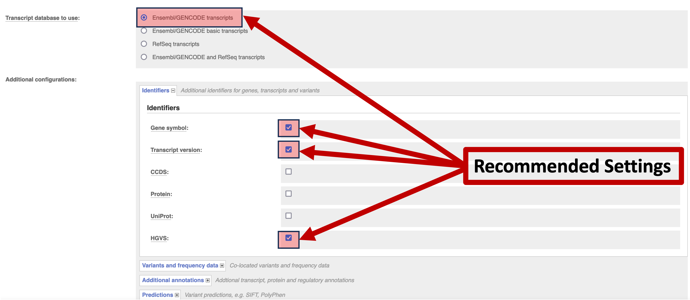

<!-- README.md is generated from README.Rmd. Please edit that file -->

```{r, include = FALSE}
knitr::opts_chunk$set(
  collapse = TRUE,
  comment = "#>",
  fig.path = "man/figures/README-",
  out.width = "100%"
)
```

# RNAProbeBuilder

<!-- badges: start -->

[](https://lifecycle.r-lib.org/articles/stages.html#experimental)
[](https://CRAN.R-project.org/package=RNAProbeBuilder)
[](https://github.com/selkamand/RNAProbeBuilder/actions/workflows/R-CMD-check.yaml)

<!-- badges: end -->

RNAProbeBuilder constructs probes for targeting RNA mutations. At least
two probes are generated per mutation, one targeted to the mutant, one
targeting wildtype sequences. Probes are all built in cDNA space.

**WARNING**: This package is in *very early development* and not ready
for use yet!!!

## Installation

You can install the development version of RNAProbeBuilder from
[GitHub](https://github.com/) with:

``` r
# install.packages("devtools")
devtools::install_github("selkamand/RNAProbeBuilder")
```

## Usage

### **1 \| Prepare Inputs:**

RNAProbeBuilder probe designs are based on cDNA HGVS notation. Start by
taking your list of mutations, and annotate it using
[VEP](https://asia.ensembl.org/Tools/VEP) annotate impacts in cDNA space
(importantly this retrieves the impact across all isoforms of a
transcript)

Use the online / offline VEP (latest
[hg38](https://asia.ensembl.org/Tools/VEP) or
[hg37](https://grch37.ensembl.org/Homo_sapiens/Tools/VEP) cache are a
good choice)

You annotations should include cDNA HGVS notation like the following:
NM_004006.2:c.4375C\>T

(transcript:c.positionRef\>Alt)

**Configuring VEP**



-   Identifiers:
    -   Gene Symbol
    -   Transcript Version
    -   HGVS
-   Transcript Database
    -   Ensembl[/GENCODE]{.underline} transcripts

**Downloading Results**

Download / save all results in TXT format


This downloaded text file will serve as the input to

### 2 \| Connect to biomaRt

This will let us pull the cDNA sequences we need to construct probes

```{r, eval=FALSE}
# If varants are GRCh37 / hg19:
ensembl <- load_biomart(GRCh = "37")

# If variants are GRCh38 / hg38
ensembl <- load_biomart(GRCh = "38")
```

### 3 \| Build probes from VCF

```{r eval=FALSE}
probes_read_vep_txt("path_to_vep_text", ensembl=ensembl) |> # Read in Probe data
  probes_construct( # Constructs 1 probe for each mrna mutation
    bp_upstream = 20, 
    bp_downstream = 20,
    probe_type = "cDNA" # only cDNA supported for now
  )  |>
  probes_collapse_duplicates() |> # Collapse probes 
  probes_write_output(outdir = "Outdir", prefix = "myprobes") # Write FASTA / QC files
  
```

### 4 \| Build probes from fusion sequences

Start with a data.frame with the following columns

-   Fusion_Sequence (cDNA nucleotide sequence with breakpoint indicated
    by '\|')

-   GenesInvolved

```{r, eval=FALSE}
probes_construct_fusion_sequence
```

## FAQ

**Q: My mutation may affect multiple isoforms? How do i handle this?**

A: By default, VEP describes the impact of mutations for EVERY isoform
in the annotations Ensembl/Gencode. `probes_read_vep_txt()` parses
isoform level impacts, and `probes_construct()` creates one WT/Mut pair
of probes per isoform hit, NOT 1 probe per genomic mutation.

Where probes for multiple mutant isoforms would have identical
sequences, `probes_collapse_duplicates()` will collapse these into
single probe pairs. If you know in advanced what isoforms you care
about - simply filter the output of `probes_read_vep_txt()` to include
only those isoforms

**Q: What variant types are supported**

A: Currently just SNVs and Dups. No Indels, fusions or large deletions
supported
